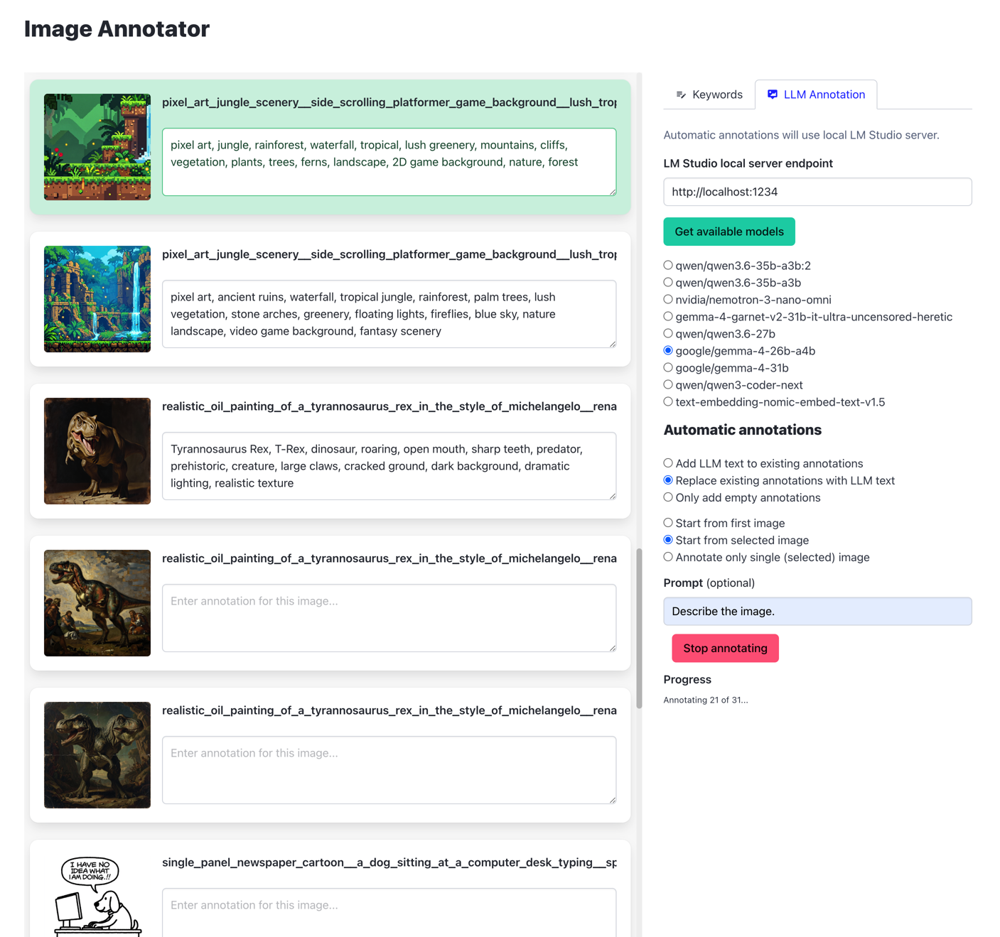
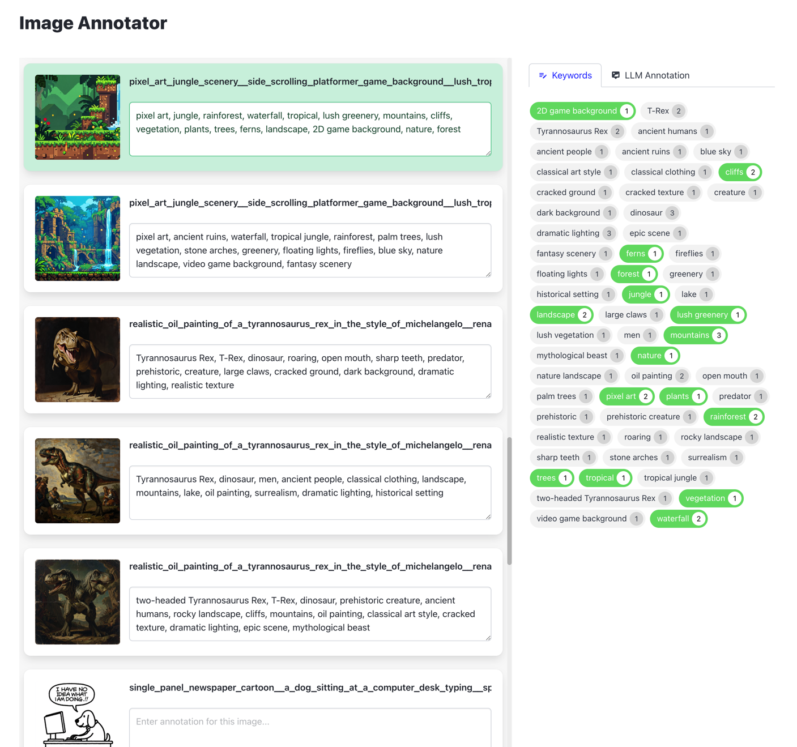
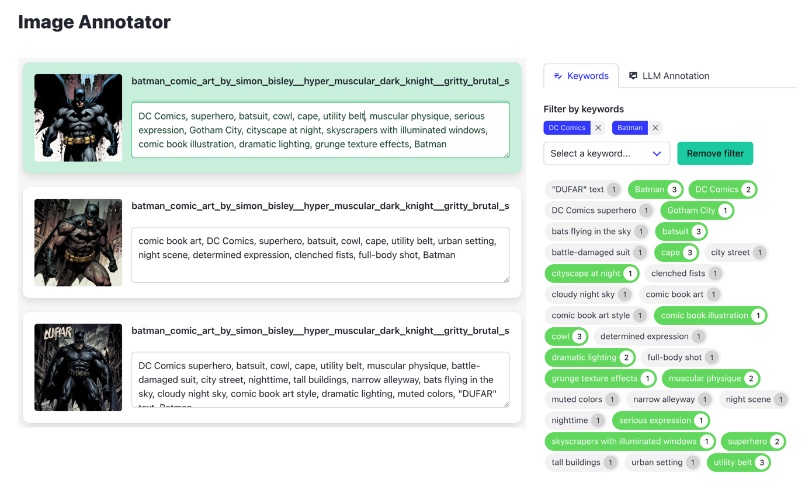
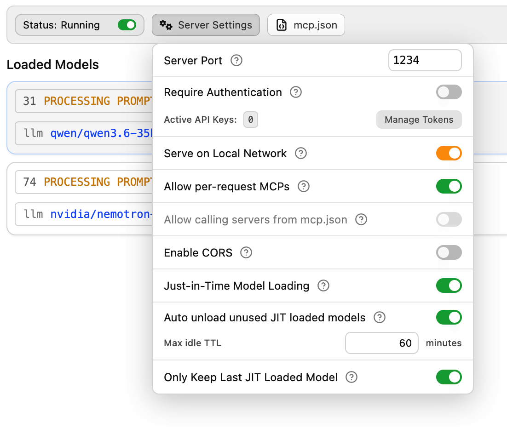

# Image Annotator

A lightweight web application for managing and generating image annotations. Useful for preparation and preservation of LoRA training sets. Browse local image directories, add manual tags, and leverage local LLMs (via LM Studio) to automatically generate keywords and descriptions (or you may do so manually).

## ✨ Features

* **Directory Scanning:** Instantly load images from any local directory (just copy the Pathname in Finder, if you're on Mac).
* **Manual Annotation:** Edit text annotations for each image; they are saved as `[image name].txt` files in the same directory as the annotated image. This is a Draw Things friendly way of storing image annotations for LoRA training (use "Import from folder..." in Draw Things when adding images for training).
* **Keyword Management:** Visual tags for quick keyword management (add / remove keyword or phrase from selected image just by clicking the tags).
* **Filtering by Keywords:** Select one or more keywords / phrases to filter images that already contain them. Work with this filtered selection (modify annotations, run automatic annotations).
* **Automated LLM Annotation:** 
  * Integrated with **LM Studio** for on-device image understanding.
  * **Modes:** Three modes for LLM annotation: add to existing, replace existing, or skip for already annotated images.
  * **Scopes:** Three modes for running the batch annotation: for all images, forward from a selected image, or a single (selected) image.
* **Automatic `.txt` file saves:** All the annotations are instantly saved upon edits.


**Screenshot 1:** Local LLM powered automatic annotation (LM Studio required.)



**Screenshot 2:** Manual annotation using reusable keywords / phrases (older version without filtering).


**Screenshot 3:** New filtering option: choose one or more keywords to filter just a subset of annotated images.


## 🛠️ Installation

### Prerequisites
* [Node.js](https://nodejs.org/) (v14 or higher)
* [LM Studio](https://lmstudio.ai/) with running server, providing at least one LLM model with "vision" capability (for optional auto-annotation)

### Setup

1. **Clone the repository**
   ```
   bash
   git clone https://github.com/lojza3d/image-annotator.git
   cd image-annotator
   ```
2. **Install dependencies**
   ```
   bash
   npm install
   ```
3. **Start the server**
   ```
   bash
   npm start
   ```
4. Open your browser and navigate to `http://localhost:3000`

## 📖 Usage

### Manual Annotation

1. Enter the full path to your image directory in the input field
   - You can paste paths enclosed in double or single quotes (e.g., `"/Users/yourname/Pictures/images"`)
   - The app automatically removes the quotes
   - If you're on Mac, make sure the Path Bar is displayed in Finder (View → Show Path Bar), then select the image folder in Finder window and right click on its name in the Path Bar. Use "Copy as Pathname" and paste the result to Image Annotator entry field.
2. Click "Scan Directory"
3. The application will automatically detect all images and their corresponding .txt files, if any exist
4. Edit annotations directly in the text areas or select the image tile and click the tags on the right side (Keywords tab)
5. Annotations are automatically saved when you leave the text area

### Automated LLM Annotation

1. Switch to the **LLM Annotation** tab.
2. Enter your **LM Studio endpoint** (e.g., `http://localhost:1234`).
3. Click **Get available models**.
4. Select an available vision model (e.g., a multimodal LLM).
5. Configure the **Scope** (All, Forward, or Selected) and **Mode** (Add, Replace, or Skip).
6. Optionally enter a prompt for the LLM (see how to edit the system prompt below); if no prompt is filled, default prompt _"Describe the key elements of this image."_ is sent to the LLM.
7. Click **Start annotating images**.

Mandatory LLM Studio server configuration includes "Just-in-Time Model Loading" (see screenshot). Image Annotator doesn't load the model. It only unloads the used instance after the annotation loop is finished.




## 📂 File Structure

* `annotate_system_prompt.md` - Custom system prompt for the LLM loaded in LM Studio. It is sent with each annotation request. Usually sufficient, but you may edit this as per your needs. If this file is not found, a default system prompt is sent to the LLM: _"You are an image annotation assistant. Provide a comma-separated list of keywords describing the image."_
- `server.js` - Node.js backend server providing the endpoins for web GUI and taking care of filesystem integration and LM Studio integration
- `public/index.html` - Main HTML file - the web app structure.
- `public/app.js` - Main Javascript file - the web app behavior.

## ⚙️ How It Works

### Directory Scanning
1. Enter a directory path (e.g., `/Users/yourname/Pictures/images`)
2. Backend scans the directory for image files
3. For each image, checks if a corresponding .txt file exists in the same directory
4. If found, loads the annotation text into the textarea
5. When you finish editing (onBlur), saves the annotation to the same directory

### Image Serving
- Images are served via HTTP endpoints (`/image/{fullPath}`)
- Node.js reads the image file from disk and streams it to the browser
- Correct Content-Type headers are set for each image format

## ➡️ API Endpoints
This is just a documentation for internal endpoints of the `server.js`. The endpoints are used by the web app to process the images, annotations and LM Studio communication.
| Method  | Endpoint  |  Description |
|---|---|---|
|  POST |  `/api/scandir` |  Scan a directory and return image list. |
|  POST |  `/api/annotations` |  Save/update an image annotation. |
|  GET |  `/image/*` |  Stream a specific image from disk. |
|  GET |  `/api/llm/models` |  Fetch available models from LM Studio. |
|  POST |  `/api/llm/annotate` |  Trigger annotation via selected LM Studio vision model. |
|  POST |  `/api/llm/unload` |  Unloads the used model instance after annotation loop. |

## 📓 Notes & Troubleshooting

* **Test the app properly** in a folder where you can loose your data (text annotations). Always backup your annotations before you let Image Annotator to modify them.
* The app was coded partly with LLM model `qwen3.6-35b-a3b`, partly manually, and tested on macOS only.
* If the LM Studio integration doesn't work as expected...
    * Have you selected a model with vision capability? Download one with LM Studio (like qwen3.6, gemma4 or nemotron3) and select it for annotation.
    * The annotation does not start / ends immediately (HTTP 404 errors in console)? Make sure the LM Studio server is running with "Just-in-Time Model Loading" enabled.
    * The annotation fails (no text returned) and LM Studio server log contains something like "Prediction history node with id … not found in shard pack..."? Follow the workaround described here: https://github.com/lmstudio-ai/lmstudio-bug-tracker/issues/1522

## 🧱 Tech Stack

* **Backend:** Node.js, Express
* **Frontend:** Vanilla JavaScript, Bulma CSS, Material Design icons
* **Optional AI Integration:** LM Studio (via LM Studio API)

## 📜 License

MIT
